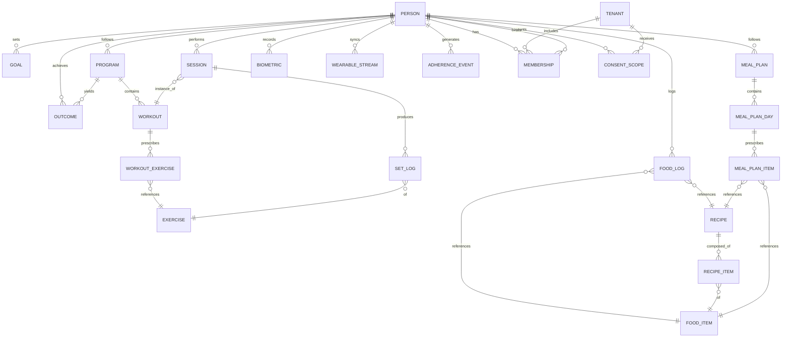
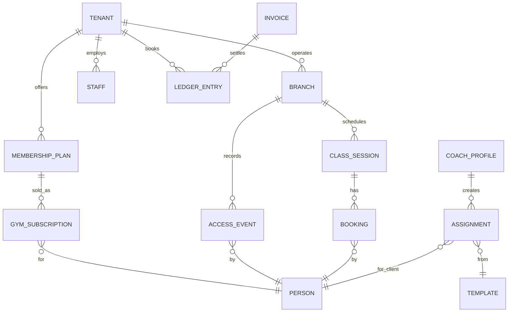

# DATABASE_DESIGN.md
### Fitness OS — Data Model, Schemas & ERD

> **Status:** Draft v1.0 · **Owner:** Database Architecture · **Last updated:** 2026-06-12
> **Document 4 of 10.** Inherits the **two-plane model** from `SYSTEM_ARCHITECTURE.md §4` (Central/Platform plane = Person + Graph + shared assets; Tenant plane = coach/gym operational data). Uses `GLOSSARY.md` names. Tables tagged **[A]** (central) or **[B]** (tenant-scoped) and a **Phase**.

---

## 1. Conventions (apply to every table)

- **Engine:** MySQL 8 / InnoDB, `utf8mb4_0900_ai_ci` (full Unicode incl. Arabic).
- **Primary keys:** **ULID** (`CHAR(26)`), client-generatable, sortable, non-enumerable (ADR-009). Column `id`.
- **Timestamps:** `created_at`, `updated_at` (UTC); soft deletes (`deleted_at`) where recovery matters; **append-only log tables are never soft-deleted or updated.**
- **Money:** stored as integer **minor units** (`BIGINT`) + ISO-4217 `currency` — never floats.
- **Tenancy:** every **[B]** table carries `tenant_id` (indexed, first column of most composite indexes) + a mandatory global scope. **[A]** tables have no `tenant_id`.
- **Localization:** translatable content uses a `*_translations` companion table or JSON `locale→value`; user `locale`, `unit_system` (metric/imperial), `timezone` on `persons`.
- **Audit:** sensitive tables emit to a central `audit_logs` stream (not shown per-table).
- **Naming:** plural snake_case tables; FK `*_id`; enums via small lookup tables or `ENUM`/string + check.

---

## 2. Plane A — Central / Platform

### 2.1 Identity & Consent (P1)

**`persons` [A]** — the portable identity (the heart of the model)
| Column | Type | Notes |
|---|---|---|
| id | ULID | PK |
| display_name | varchar | |
| email | varchar | unique |
| phone | varchar | nullable, unique (MENA: phone-first common) |
| dob, sex, height_cm | — | profile basics for AI |
| locale, unit_system, timezone, country | — | i18n/residency (A2) |
| health_screen_status | enum | none/passed/flagged (PAR-Q+ gate, FR-AI-007) |
| onboarding_state | json | |
| Indexes | (email), (phone), (country) | |

**`auth_identities` [A]** — login methods bound to a Person (email/password, Apple, Google). One Person → many providers.

**`consent_scopes` [B-bridge]** — the **only** legal join from a tenant to a Person's Graph. `(person_id, tenant_id, data_class enum[training|nutrition|biometrics|health|messaging], granted_at, revoked_at)`. Enforced by the consent layer, not just FK. Index `(person_id, tenant_id)`, `(tenant_id)`.

**`memberships` [B]** — a Person's relationship to a Tenant. `(id, tenant_id, person_id, type enum[client|gym_member|staff], role_id, status, joined_at, left_at)`. Index `(tenant_id, person_id)` unique, `(person_id)`.

### 2.2 The Graph (P1) — user-owned, append-only where possible

**`goals` [A]** — `(person_id, type, target_value, target_unit, target_date, status)`.

**`programs` [A]** — assigned/generated training plans. `(person_id, source enum[ai|coach|template|self], coach_id?, template_id?, name, start_date, mesocycle_json, status)`.

**`workouts` [A]** — ordered session templates within a Program. `(program_id, day_index, name, ordering)`.

**`workout_exercises` [A]** — prescription rows. `(workout_id, exercise_id, order, target_sets, target_reps, target_load, rest_sec, tempo, notes)`.

**`sessions` [A]** — a performed Workout instance. `(person_id, workout_id?, started_at, ended_at, perceived_effort, source)`. **Append-only.** Partition by month.

**`set_logs` [A]** — the densest table. `(session_id, person_id, exercise_id, set_index, reps, load, rpe, rir, tempo, logged_at, client_ulid)`. **Append-only, immutable** (corrections = new rows). **Partition by `logged_at` (monthly)**; index `(person_id, exercise_id, logged_at)` for PR/trend queries.

**`personal_records` [A]** — denormalized PRs derived from `set_logs` (read-model, refreshed async). `(person_id, exercise_id, metric, value, achieved_at, session_id)`.

**`food_logs` [A]** — `(person_id, food_item_id?, recipe_id?, meal_type, servings, kcal, protein, carbs, fat, micros_json, logged_at, client_ulid, source enum[search|barcode|image|voice])`. **Append-only**, partition by `logged_at`.

**`meal_plans` [A]** — structured nutrition plan; the **nutrition analog of `programs`** (FR-AI-002 / FR-CCH-004). `(person_id, source enum[ai|coach|template|self], coach_id?, template_id?, name, daily_targets_json {kcal,protein,carbs,fat}, start_date, status)`.

**`meal_plan_days` [A]** — days within a MealPlan. `(meal_plan_id, day_index, name, ordering)`.

**`meal_plan_items` [A]** — prescribed meals (mirrors `workout_exercises`). `(meal_plan_day_id, meal_type, food_item_id?, recipe_id?, servings, target_kcal, target_macros_json, ordering, notes)`.

**`water_logs` [A]**, **`supplement_logs` [A]** — append-only intake events.

**`biometrics` [A]** — `(person_id, type enum[weight|bodyfat|circumference|...], value, unit, measured_at)`. Append-only time series.

**`progress_photos` [A]** — `(person_id, storage_key, taken_at, pose, encrypted)`. **Encrypted at rest, extra-protected** (NFR-SEC-001). Only signed-URL access.

**`wearable_streams` [A]** — high-write time series `(person_id, source, metric enum[hr|hrv|sleep|steps], value, recorded_at)`. Partition by `recorded_at`; candidate for TSDB migration (ARCH §8).

**`adherence_events` [A]** — `(person_id, kind enum[workout|meal|checkin|habit], expected_at, fulfilled_at?, status)`. Feeds churn/engagement scoring.

**`outcomes` [A]** — the **training labels** (MASTER §9): `(person_id, program_id?, metric, baseline, result, delta, period_start, period_end, goal_attained bool)`. This is what makes the Graph a supervised dataset.

### 2.3 Shared assets (P1)

**`exercises` [A]** — global library. `(name, slug, primary_muscles json, secondary_muscles json, equipment json, mechanics, media_keys json, instructions_i18n json, contraindications json)`. **`contraindications` powers the AI safety gate.** FK target for `workout_exercises`, `set_logs`.

**`food_items` [A]** — licensed/aggregated DB. `(source, external_ref, name_i18n, brand, barcode, serving_units json, kcal, macros, micros json, region)`. Indexed by `barcode`, full-text/Meili by `name`. Localized (A2). Large table; read-optimized + cached.

**`recipes` [A]** / **`recipe_items` [A]** — user/coach/system recipes composed of `food_items`.

### 2.4 Engagement (P1)

**`habits` [A]**, **`habit_logs` [A]**, **`streaks` [A]**, **`xp_ledger` [A]** (append-only XP events → derived level), **`badges` [A]** / **`person_badges` [A]**, **`challenges` [A]** / **`challenge_participants` [A]**.

### 2.5 AI (P1)

**`ai_interactions` [A]** — every Brain call: `(person_id, tenant_id?, feature, model, tier, tokens_in, tokens_out, cost_micros, latency_ms, confidence, safety_verdict, accepted bool?, created_at)`. **Drives the AI-cost dashboards (NFR-OPS-002) and graduated-autonomy learning (FR-AI-010).** Partition by month.

**`ai_credit_wallets` [A]** — `(owner_type enum[person|tenant], owner_id, balance, plan_grant, period_reset_at)`.
**`ai_credit_ledger` [A]** — append-only debits/credits (mirrors money ledger pattern).

### 2.6 SaaS billing — platform level (P1)

**`plans` [A]** — sellable SaaS tiers `(audience enum[b2c|coach|gym], name, price_micros, currency, interval, limits_json, ai_credit_grant, features_json)`.
**`saas_subscriptions` [A]** — *(named `saas_` to disambiguate from `gym_subscriptions` [B] in §3.4 — different concept, different plane)* `(subscriber_type enum[person|tenant], subscriber_id, plan_id, status, trial_ends_at, current_period_end, psp_ref)`.
**`coupons` [A]**, **`coupon_redemptions` [A]**.

### 2.7 Platform admin (P1)

**`tenants` [A]** — registry of all tenants (the landlord table). `(id, type enum[individual_coach|gym|fitness_company], name, slug, custom_domain?, region, db_mode enum[pooled|dedicated], db_ref?, status)`. **`db_mode`/`db_ref` implement the hybrid tenancy of ARCH §4.3.**
**`audit_logs` [A]** — immutable `(actor_type, actor_id, tenant_id?, action, subject_type, subject_id, meta_json, ip, created_at)`.

---

## 3. Plane B — Tenant-scoped (pooled shared-DB by default; dedicated DB for enterprise)

All tables below carry `tenant_id` + global scope. For `db_mode=dedicated` tenants, these live in a region-pinned database; `tenant_id` is still present for code uniformity.

### 3.1 Coaching (P2)

- **`coach_profiles` [B]** — branding (logo, colors, custom domain), bio, specialties, languages, pricing.
- **`templates` [B]** — reusable Program/MealPlan blueprints (`kind`, `structure_json`, visibility for marketplace).
- **`assignments` [B]** — Template/Program bound to a Client `(tenant_id, coach_id, client_person_id, template_id, program_id, schedule_json, status)`.
- **`checkin_forms` [B]** / **`checkin_submissions` [B]** — custom forms + responses (+ media, metrics snapshot).
- **`messages` [B]** / **`conversations` [B]** — Client↔Coach chat (media attachments; real-time via Reverb).
- **`coach_clients` [B]** — roster view (denormalized from `memberships` type=client) with stage, ChurnRisk, EngagementScore.

### 3.2 Marketplace (P2)

- **`coach_listings` [A/B]** — discovery index (specialty, price, language, rating) — surfaced centrally for matching.
- **`leads` [B]** / **`trials` [B]** — funnel from B2C→Client.
- **`template_sales` [B]** — sold templates + revenue share (settled via ledger).

### 3.3 Payments & Ledger (P2)

- **`payment_methods` [B]** — PSP tokens only (no PAN; NFR-SEC-004).
- **`invoices` [B]** / **`invoice_lines` [B]**, **`receipts` [B]**.
- **`payments` [B]** — `(tenant_id, payer_person_id, amount_micros, currency, psp, psp_ref, status)`.
- **`refunds` [B]**, **`discounts` [B]**, **`promotions` [B]**.
- **`ledger_entries` [B]** ⭐ — **double-entry** `(tenant_id, account, debit_micros, credit_micros, currency, ref_type, ref_id, posted_at)`. Balanced; source of truth (FR-FIN-003). Reconciled vs PSP webhooks (`psp_events [B]`).
- **`payouts` [B]**, **`commissions` [B]** (staff/coach), **`platform_fees` [B]** (marketplace take-rate).

### 3.4 Gym Ops (P3)

- **`branches` [B]** — locations under a gym `(tenant_id, name, address, geo, capacity, timezone)`.
- **`membership_plans` [B]** — `(tenant_id, branch_scope, name, price_micros, duration, access_rules_json, class_entitlements_json)`.
- **`gym_subscriptions` [B]** — a member's plan instance `(tenant_id, member_person_id, membership_plan_id, status enum[active|frozen|expired|cancelled], freeze_history_json, start, end)`.
- **`family_memberships` [B]** — links related member subscriptions.
- **`access_cards` [B]** — `(tenant_id, person_id, type enum[qr|barcode|nfc], token, active)`.
- **`access_events` [B]** — **high-write** `(tenant_id, branch_id, person_id, direction enum[in|out], method, occurred_at)`. Partition by `occurred_at`; powers occupancy & attendance.
- **`class_definitions` [B]** / **`class_sessions` [B]** — schedule with capacity, instructor, optional resource. `class_sessions.kind enum[group|pt|resource]` so **one bookable-session model covers group classes, PT sessions, and court/resource reservations** (FR-GYM-010/012). (Removes the need for a separate PT-slot entity.)
- **`bookings` [B]** — `(tenant_id, class_session_id, person_id, status enum[booked|waitlist|attended|no_show|late_cancel], fee_micros?)`. *(Always references a `class_session`; PT/resource bookings are `class_sessions` of the matching `kind`.)*
- **`resources` [B]** — courts/rooms/equipment referenced by `class_sessions.kind=resource`.
- **`staff` [B]** / **`staff_schedules` [B]** / **`staff_attendance` [B]** / **`payroll_runs` [B]**.
- **`waivers` [B]** — signed documents/e-signatures `(tenant_id, person_id, doc_key, signed_at, ip)`.
- **`broadcasts` [B]** — segmented push/email/SMS campaigns.
- **`sales_pipeline` [B]** — gym CRM leads/stages.
- **`member_transfers` [B]** — between branches.

### 3.5 Analytics read-models (P1→, A or B by scope)

- **`engagement_scores`**, **`churn_risk`** — per-Person (central) and per-membership (tenant) computed read-models, refreshed async (NFR-AN-004). Never computed inline on the hot path.

---

## 4. Core ERD (the Graph — Plane A)

### Tenant-plane ERD (Plane B, P2/P3)

---

## 5. Indexing, partitioning & scale (NFR-SCAL)

| Table | Strategy |
|---|---|
| `set_logs`, `food_logs`, `access_events`, `wearable_streams`, `ai_interactions` | **Range partition by month** on the time column; composite index `(person_id/tenant_id, …, time)`; archive cold partitions |
| `personal_records`, `engagement_scores`, `churn_risk` | **Derived read-models**, refreshed by queued jobs — never computed on request |
| `food_items` | Read-heavy; Redis cache + Meilisearch index; rarely written |
| `persons`, `memberships` | Hot lookups; cover with composite indexes; cache profile |
| Reporting | Served from **read replicas**; heavy aggregation → OLAP store (P3) |

**Sharding posture:** partition first; shard later only if a single primary is the proven bottleneck. Natural shard keys: `person_id` (Plane A), `tenant_id` (Plane B). ULIDs make future sharding clean.

---

## 6. Data lifecycle, privacy & integrity

- **Portability/Deletion (FR-IDN-004, NFR-SEC-005):** a Person can export the full Graph and delete their account; deletion cascades central data and **revokes all consent scopes**, but tenant *operational records required for legal/financial retention* (invoices, ledger) are retained per policy with the Person pseudonymized.
- **Consent is enforced at query time:** tenant-actor reads of Plane-A data pass through the consent layer; a revoked scope immediately blocks access.
- **Append-only logs** give a tamper-evident history and conflict-free sync (ARCH §7).
- **Residency (A2, ADR-008):** dedicated-DB enterprise tenants are pinned to their region; central plane respects regional storage for PII where required.
- **Referential integrity** within a plane via FKs; **cross-plane links (Membership/Consent → Person) are application-enforced**, since planes may live in different databases.

---

## 7. Invariants (must always hold)

- `INV-001` Every Plane-B row has a non-null `tenant_id`; no query returns rows across tenants (NFR-SEC-002).
- `INV-002` A `set_log`/`food_log`/`access_event` is never updated or deleted (append-only).
- `INV-003` `ledger_entries` for any transaction sum to zero (debits = credits).
- `INV-004` A tenant can read a Person's Graph data class **iff** an active `consent_scope` exists.
- `INV-005` AI output is persisted only after passing the safety post-eval (FR-AI-007 / NFR-AI-002).
- `INV-006` Money is integer minor units + currency; never float.

---

> **Next document:** `ROLES_PERMISSIONS.md` — the RBAC × tenant-scope × consent-scope model (ARCH §10), every role across all segments, and the permission matrix.
